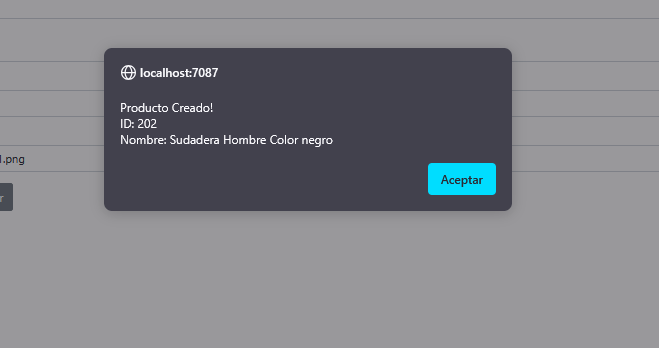
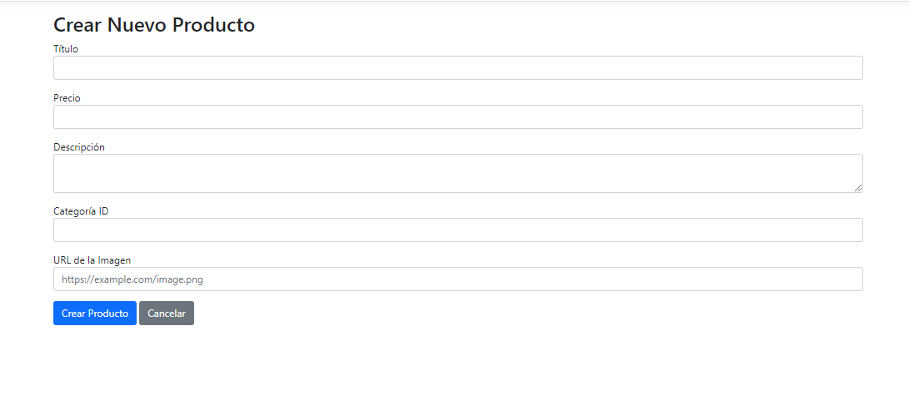
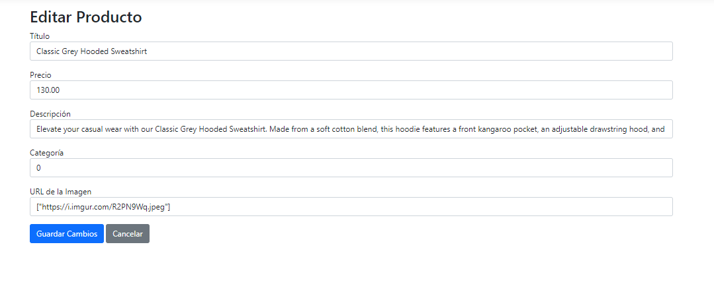
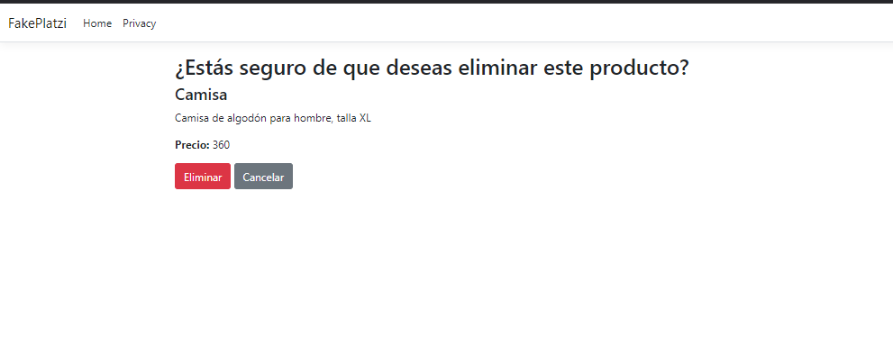
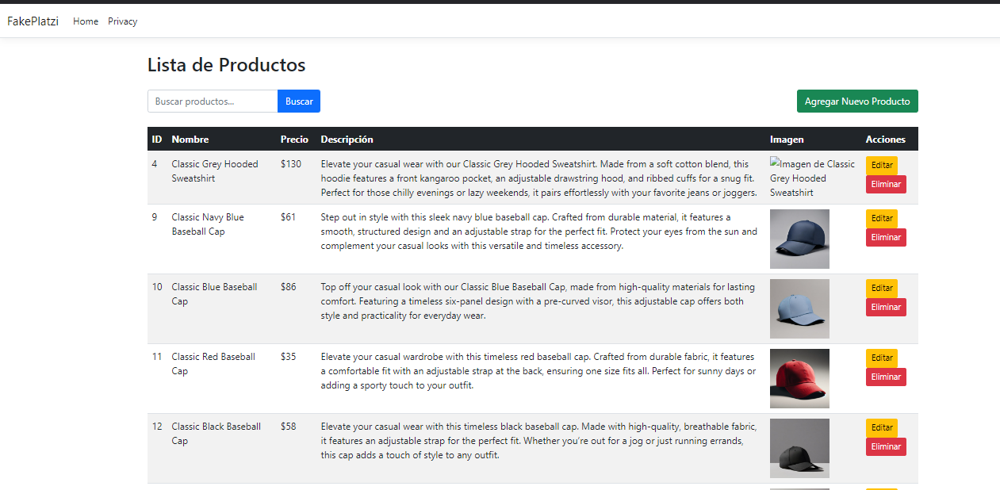

# Fake Platzi API

Se creo un CRUD para consumir la API de Fake Platzi, la creacion, eliminarcion y edicion cumplen su función. El unico punto que falto fue mostrar una alerta al momento de editar un registro, mostrar el id y el titulo del producto que se edito. 

## Screenshots

## Tech Stack

**Client:** HTML, CSS, BOOSTRAP, JavaScript
**Server:** HttpClient, C#

